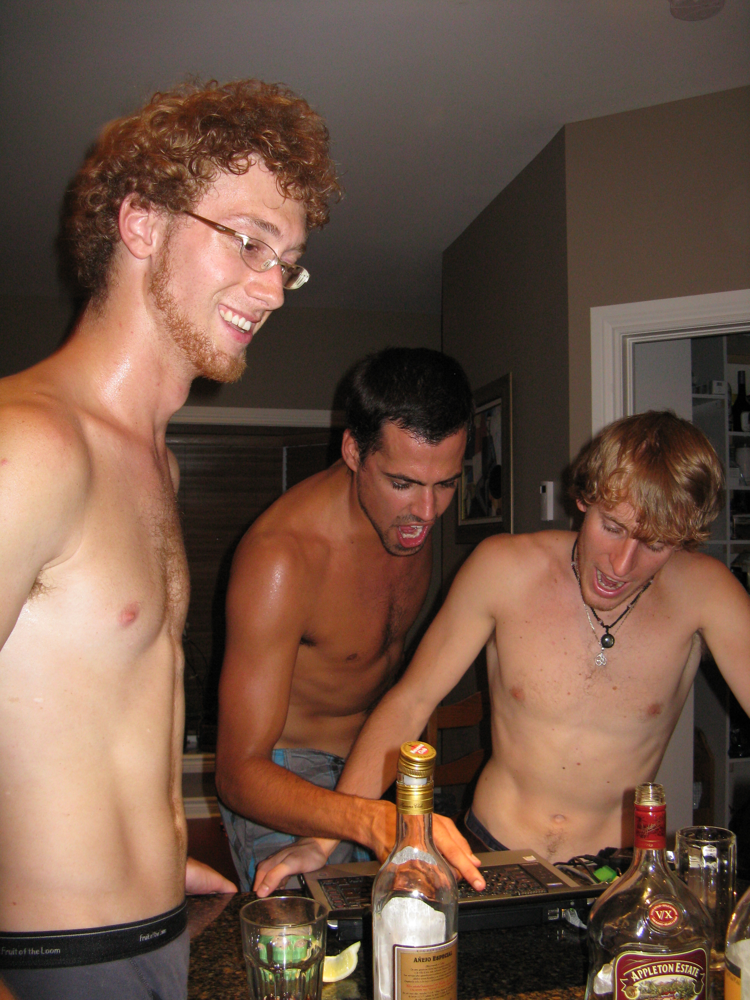

Merci antoine pour tout ton dévouement. Sans toi, tout le monde n'aurait pas eu autant de fun à chialer l'un contre l'autre. Tout le monde en ressort changé... pour le meilleur et pour le pire dans cette fin de trentaine qui achève pour tout le monde. 
Oussé qu'on ça va? oussé que les **Give me een klap papa** seront à l'aube de leur quarantaine. C'est certain qu'on ne peut pas dire que tu n'as pas peur de te mouiller. Allez sautez dans la vie les amis et suivez Antoine...

## Merci de toujours être là
Tu es fidèle au poste depuis plus de 10 ans à choisir la meilleur musique qu'il existe.

## Les remerciements
### captnmeaty
Antoine, t’as mis la barre haute avec tes choix. Merci pour les découvertes et les vibes toujours un peu inattendues — respect.

### Juif en anglais
Antoine, merci pour ta constance et ton flair musical. T’as clairement apporté une belle richesse à la ligue.

### Alexandre
Antoine, merci pour ton implication et ton sens du détail dans tes sélections. Toujours pertinent, souvent surprenant — c’est apprécié.

### Francois Danielovic Duchesne
Antoine, tes propositions avaient une signature unique. Merci d’avoir contribué à élever le niveau global de la ligue.

### Guillaume St-Georges
Antoine, merci pour les découvertes et les débats que tes choix ont suscités. Toujours un plaisir.

### PY
Antoine, solide tout le long. Merci pour les tracks, les prises de risque et le bon goût constant.

### Christian St-Georges
Antoine, merci pour ton engagement et ta passion musicale. Tes choix ont clairement marqué cette saison.

### Adrien Lavoie
Antoine, merci pour les surprises et les moments “wow”. T’as rendu ça intéressant du début à la fin.

### Antoine Querry (auto-message)
Merci à moi-même pour ces choix audacieux et incompris — un génie ne se révèle jamais immédiatement.

### [Left the league]
Antoine, même de loin, respect pour ta contribution. T’as laissé ta trace.